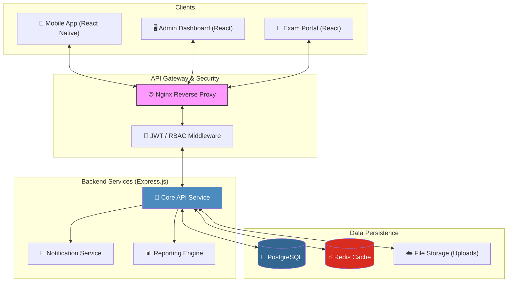

# 🏗️ UniPilot System Architecture

UniPilot is a premium, unified university management ecosystem designed for high efficiency, scalability, and seamless user experience. It integrates academic, administrative, and student-centric modules into a single synchronized platform.

---

## 🚀 Technology Stack

| Layer                    | Technology        | Purpose                                         |
| :----------------------- | :---------------- | :---------------------------------------------- |
| **Mobile**         | React Native      | Cross-platform student & faculty application    |
| **Web Frontend**   | React / Vite      | Administrative & Exam management dashboards     |
| **Backend API**    | Node.js (Express) | High-performance RESTful API services           |
| **Real-time**      | Socket.io         | Instant notifications and live updates          |
| **Database**       | PostgreSQL        | Relational data for academics & finance         |
| **Caching**        | Redis             | Session management and performance optimization |
| **Infrastructure** | Docker / Nginx    | Containerized deployment and load balancing     |

---

## 🌲 Feature Hierarchy (Tree Breakdown)

### 1. 🎓 Academic Management

* **Curriculum & Structure**
  * 🏛️ Department & Program Management
  * 📚 Course Management (Syllabus, Credits)
  * 📜 Academic Regulations & Promotion Criteria
* **Operations**
  * 📅 Timetable & Slot Management
  * 🏛️ Infrastructure (Buildings, Blocks, Rooms)
  * 🗓️ Holiday & Academic Calendars

### 2. 🎯 Outcome-Based Education (OBE)

* **Outcomes**
  * 🗺️ Program Outcomes (POs) & PSOs
  * 🎯 Course Outcomes (COs)
* **Mappings**
  * 🔗 CO-PO Mapping Matrix
* **Assessments**
  * 📈 Attainment Calculations

### 3. 📝 Examination System

* **Lifecycle**
  * 🔄 Exam Cycles & Scheduling
  * 🎟️ Hall Ticket Generation
  * 🪑 Seating Arrangement (Automatic/Manual)
* **Grading**
  * ✍️ Faculty Grade Entry
  * ⚖️ HOD Approvals & Moderation
  * 📄 Semester Results & Marksheets

### 4. 👥 Student & Administrative Services

* **Finance & Accounting**
  * 💳 Fee Dashboard & Online Payments
  * 📒 Fee Ledger & Transaction History
  * 🏷️ Fee Categories & Waivers
* **Logistics**
  * 🚌 Transport: Route Allocation, Trip Logging, Vehicle Tracking
  * 🏠 Hostel: Room Allocation, Attendance, Gate Pass, Complaints
* **Resources**
  * 📖 Library: Book Management, Issues/Returns
  * 📂 Student Documentation & Profile Management

### 5. 💼 HR & Operations

* **Staff Management**
  * 👤 Personnel Records
  * 🕒 Attendance & Biometric Integration
  * 🌴 Leave Requests & Balances
* **Payroll**
  * 💰 Salary Grades & Structures
  * 📄 Payslip Generation

### 6. 🎓 Placement Module

* **Drives**
  * 📢 Placement Drive Management
  * 🏢 Company & Job Posting Details
* **Student Portal**
  * ✅ Eligibility Checking
  * 📄 Application History
  * 👤 Placement Profile Management

### 7. 🛡️ Identity & Analytics

* **Security**
  * 🔐 RBAC (Role-Based Access Control)
  * 🆔 JWT Authentication & Refresh Tokens
  * 📝 Audit Logging
* **Insights**
  * 📊 Dashboard Analytics (Student, HOD, Admin views)
  * 🔔 Multi-channel Notifications

---

## 📊 System Architecture Diagram

---

---

## 🌳 Feature Architecture Tree

```mermaid
graph LR
    Root((UniPilot))

    Root --> Academic
    Root --> OBE
    Root --> Exams
    Root --> Finance
    Root --> StudentServices
    Root --> Ops
    Root --> Placement


    subgraph "Academic Management"
        direction TB
        Academic --> DeptProg[Departments & Programs]
        Academic --> CourseMgmt[Course Management]
        Academic --> Regs[Regulations]
        Academic --> TTable[Timetable]
        Academic --> Infra[Infrastructure]
    end

   
    subgraph "Outcome Based Education"
        direction TB
        OBE --> POs[POs & PSOs]
        OBE --> COs[Course Outcomes]
        OBE --> Mapping[CO-PO Mapping]
        OBE --> Attain[Attainment]
    end

    subgraph "Examination System"
        direction TB
        Exams --> Cycles[Exam Cycles]
        Exams --> Seating[Seating & Hall Tickets]
        Exams --> Grades[Grade Entry]
        Exams --> Results[Results & Moderation]
    end

    subgraph "Finance & Accounting"
        direction TB
        Finance --> FeeDash[Fee Dashboards]
        Finance --> Payments[Online Payments]
        Finance --> Ledger[Ledger & History]
        Finance --> Waivers[Waivers & Fines]
    end

    subgraph "Student & Logistics"
        direction TB
        StudentServices --> Hostel[Hostel & Mess]
        StudentServices --> Transport[Transport & Logs]
        StudentServices --> Library[Library]
        StudentServices --> Profile[Digital Profile]
    end

    subgraph "HR & Operations"
        direction TB
        Ops --> HRPayroll[HR & Payroll]
        Ops --> Attendance[Staff Attendance]
        Ops --> Biometric[Biometric Sync]
        Ops --> Assets[Asset Management]
    end

    subgraph "Placement Module"
        direction TB
        Placement --> DriveMgmt[Drive Management]
        Placement --> CompDash[Company Dashboard]
        Placement --> Eligibility[Eligibility Check]
        Placement --> Portal[Application Portal]
    end

    style Root fill:#111827,color:#fff,stroke:#000,stroke-width:3px

    style Academic fill:#E0F2FE, color:#000,stroke:#0284C7,stroke-width:2px
    style OBE fill:#FCE7F3,color:#000,stroke:#DB2777,stroke-width:2px
    style Exams fill:#FEF3C7,color:#000,stroke:#D97706,stroke-width:2px
    style Finance fill:#DCFCE7,color:#000,stroke:#16A34A,stroke-width:2px
    style StudentServices fill:#EDE9FE,color:#000,stroke:#7C3AED,stroke-width:2px
    style Ops fill:#F1F5F9,color:#000,stroke:#475569,stroke-width:2px
    style Placement fill:#FFE4E6,color:#000,stroke:#E11D48,stroke-width:2px

```

---

> [!IMPORTANT]
> This architecture is designed for a multi-tenant university environment ensuring data isolation and high availability across all core modules.
