# 🔐 UniPilot Role Architecture

This document defines the functional boundaries and access levels for various user roles within the UniPilot ecosystem. The system employs a Hybrid Security Model combining **Role-Based Access Control (RBAC)** and **Granular Permissions**.

---

## 👥 Role Hierarchy & Access Summary

| Role | Access Level | Primary Focus |
| :--- | :--- | :--- |
| **Super Admin / Principal** | 👑 Full Bypass | Total system configuration, settings, and multi-tenant management. |
| **Academic Dean** | 🏛️ Strategic Admin | Academic planning, curriculum oversight, and department-level approvals. |
| **Exam Admin** | 📝 Exam Controller | Exam lifecycle management, hall tickets, seating, and result moderation. |
| **HR Admin** | 💼 HR Manager | Staff onboarding, payroll, leave management, and attendance oversight. |
| **Placement Head** | 🎓 Placement Officer | Drive coordination, company relations, and success metrics. |
| **Hostel Admin** | 🏘️ Hostel Manager | Room allocations, gate passes, utility bills, and student conduct. |
| **Transport Admin** | 🚌 Logistics Manager | Route planning, vehicle maintenance, and student transport allocations. |
| **Financial Admin** | 💰 Fee Manager | Fee collections, counter payments, and scholarship management. |
| **HOD (Head of Dept)** | 🏢 Dept. Manager | Departmental staff/student oversight, paper freezing, and local dashboards. |
| **Faculty** | 👩‍🏫 Instructor | Grade entry, attendance marking, and course content management. |
| **Student** | 🎓 End User | Personal academics, fee payments, and hostel/transport service requests. |

---

## 🌲 Feature Access Breakdown

### 1. 👑 Super Admin & Principal

* **📊 Dashboard**: Centralized metrics and system-wide overview.
* **📋 Admissions**: Oversight of new student applications and onboarding.
* **🏛️ Academics**: Programs, Departments, and Curriculum management.
* **💼 HR Management**: Staff records, Attendance, and Payroll.
* **🎓 Students**: Comprehensive student directory and academic tracking.
* **🏢 Infrastructure**: Campus assets, Buildings, and Facilities.
* **👤 My HR**: Personal portal for the Admin/Principal's own HR needs.
* **👛 Fee Management**: Financial oversight, Ledgers, and Payment verification.
* **🚌 Transport**: Route tracking, Vehicle logs, and driver management.
* **🏚️ Hostel**: Room allocations, gate passes, and complaints management.
* **💼 Placements**: Drive coordination and student eligibility.
* **⚙️ Roles & Permissions**: RBAC configuration and security control.

### 2. 🏛️ Academic Dean

* **🏢 Departments**: Oversight of academic departments, HOD appointments, and settings.
* **🎓 Programs**: Management of degree programs, branches, and specializations.
* **📜 Regulations**: Configuration of academic regulations, credit systems, and grading.
* **📚 Courses**: Catalog management, syllabus control, and course-program mapping.
* **🗂️ Sections**: Managing class sections, student groups, and section data.
* **🔄 Lifecycle**: Handling student promotions, year-end processing, and lifecycle events.
* **📅 Schedule Management**: Timetable configuration, class timings, and faculty assignments.
* **🗓️ Academic Calendar**: Defining events, holidays, and semester schedules.

### 3. 📝 Exam Admin (Examination Control)

* **Lifecycle**: Create and manage Exam Cycles, Timetables, and Fee configurations.
* **Logistics**: Seating arrangement generation and Hall Ticket publishing.
* **Results**: Marksheet generation, Grade scale configuration, and result publication.
* **Audit**: Reviewing exam-related action logs.

### 4. 💼 HR Admin

* **👥 Employee Directory**: Managing staff profiles, roles, and employment details.
* **📥 Employee Onboarding**: Onboarding new staff and recruitment workflows.
* **💰 Payroll Dashboard**: Managing salaries, deductions, and payroll processing.
* **📈 Salary Grades**: Defining pay scales and salary structures.
* **🏖️ Leave Management**: Tracking and approving employee leave and balances.
* **⏱️ Staff Attendance**: Monitoring daily attendance and work hours.
* **📅 Staff Calendar**: Managing staff schedules, holidays, and work shifts.

### 5. 🎓 Placement Head

* **🏢 Partner Companies**: Managing company relations and active partnerships.
* **📋 Job Board**: Drafting job postings, creating new recruitment opportunities.
* **📅 Drive Management**: Tracking upcoming recruitment drives and live events.
* **👥 Manage Coordinators**: Overseeing placement team roles and responsibilities.
* **📊 Success Metrics**: Monitoring student placement stats and total offers.

### 6. 🏘️ Hostel Admin

* **🏢 Buildings & Infrastructure**: Managing hostel buildings and facilities.
* **🏠 Room Management**: Viewing and managing hostel rooms and bed status.
* **👥 Allocations**: Assigning students to rooms and beds.
* **💳 Fees Structure**: Managing hostel and mess fee configurations.
* **⚖️ Student Fines**: Issuing and tracking conduct-related fines.
* **🧾 Utility Bills**: Creating and distributing bills for room utilities.
* **🔧 Complaints**: Tracking and resolving student-reported maintenance or issues.
* **⏱️ Attendance**: Marking and viewing daily student attendance in hostels.
* **🛡️ Gate Passes**: Managing entry/exit requests and security logs.

### 7. 🚌 Transport Admin

* **🗺️ Route Network**: Managing paths, stops, and route efficiency.
* **🚐 Vehicle Fleet**: Monitoring vehicle maintenance, status, and health.
* **👥 Staff Directory**: Managing driver profiles and transport assistants.
* **🎒 Allocations**: Managing student assignments to specific routes/vehicles.
* **📔 Trip Logs**: Recording and viewing daily trips and special event transport.
* **📈 Analytics**: Insightful reports on transport revenue and fleet performance.

### 8. 💰 Financial Admin

* **🔭 Overview**: Financial health dashboard and collection metrics.
* **💳 Counter Payment**: Manual fee collection terminal for Cash, Bank Transfe, and Cheques.
* **⚖️ Fines & Charges**: Issuing and managing student fines and miscellaneous charges.
* **🔭 Overview**: Financial health dashboard and collection metrics.
* **💳 Counter Payment**: Manual fee collection terminal for Cash, Bank Transfe, and Cheques.
* **⚖️ Fines & Charges**: Issuing and managing student fines and miscellaneous charges.
* **🎓 Scholarships**: Managing scholarship applications, criteria, and disbursements.
* **🔎 Dues Monitoring**: Tracking outstanding fees and late payment monitoring.
* **📉 Fee Structures**: Configuration of academic, transport, and hostel fee sets.
* **📊 Reports**: Detailed collection reports, audit logs, and financial summaries.

### 9. 🏢 HOD (Head of Department)

* **📅 Schedule Planner**: Managing and optimizing the department-specific timetable.
* **📚 Curriculum**: Reviewing and managing courses, syllabus, and instructional materials.
* **👥 Faculty List**: Oversight of department instructors and staff profiles.
* **🔄 Student Lifecycle**: Managing promotions, year-end processing, and batch transitions.
* **📅 Schedule Planner**: Managing and optimizing the department-specific timetable.
* **📚 Curriculum**: Reviewing and managing courses, syllabus, and instructional materials.
* **👥 Faculty List**: Oversight of department instructors and staff profiles.
* **🔄 Student Lifecycle**: Managing promotions, year-end processing, and batch transitions.
* **🗂️ Manage Sections**: Organizing students into batches, groups, and class sections.
* **👩‍🏫 Assign Faculty**: Designating course instructors and faculty responsibilities.
* **📈 Analytics**: Department-level snapshots for Students, Faculty, and Course distribution.
* **🤝 Dept. Placements**: Oversight of placement activities and company interest at the department level.

### 10. 👩‍🏫 Faculty

* **📝 Marks & Grade Entry**: Entering internal marks, exam scores, and final grades for assigned courses.
* **⏱️ Attendance**: Marking daily student attendance and viewing attendance history.
* **👨‍🏫 Proctee Management**: Tracking and mentoring assigned students (Proctees).
* **📝 Marks & Grade Entry**: Entering internal marks, exam scores, and final grades for assigned courses.
* **⏱️ Attendance**: Marking daily student attendance and viewing attendance history.
* **👨‍🏫 Proctee Management**: Tracking and mentoring assigned students (Proctees).
* **📅 My Timetable**: Viewing personal instructional schedule and class timings.
* **📋 My Students**: Accessing profiles and performance data of students in assigned sections.
* **🤝 Dept. Placements**: Viewing departmental placement opportunities and company drives.
* **👤 My HR Portal**: Applying for leaves, viewing personal attendance, and downloading payslips.

### 11. 🎓 Student

* **📚 My Courses**: Viewing enrolled courses, syllabus, and learning materials.
* **📅 My Timetable**: Accessing personal academic schedule and class timings.
* **⏱️ My Attendance**: Monitoring overall and subject-wise attendance percentages.
* **🏢 Examination Hub**: Registering for exams, downloading hall tickets, and viewing seating.
* **📊 My Results**: Accessing semester-wise results, marksheet downloads, and CGPA tracking.
* **👛 My Fees**: Online fee payment portal, transaction history, and tracking dues.
* **💼 My Placements**: Tracking placement drives, application status, and eligibility.
* **🗓️ Today's Timeline**: Real-time feed of daily classes and upcoming events.

---

## 📊 Role Architecture Tree

```mermaid
flowchart TD
    Root((UniPilot Access))

    %% Vertical Stacking
    Root --> AdminGrp[Internal Command]
    Root --> OpsGrp[Operational Logistics]
    Root --> AcadGrp[Academic Core]

    %% Internal Command Branch
    AdminGrp --> SAdmin["👑 Super Admin / Principal"]
    AdminGrp --> Dean["🏛️ Academic Dean"]
    AdminGrp --> EAdmin["📝 Exam Admin"]
    AdminGrp --> FAdmin["💰 Financial Admin"]

    SAdmin --- S1[Global Config]
    SAdmin --- S2[Bulk Admissions]
    Dean --- D1[Curriculum & Regs]
    Dean --- D2[Schedule Control]
    EAdmin --- E1[Cycles & Hall Tickets]
    EAdmin --- E2[Results Audit]
    FAdmin --- FA1[Counter Payments]
    FAdmin --- FA2[Scholarships & Dues]

    %% Operational Logistics Branch
    OpsGrp --> HRAdmin["💼 HR Admin"]
    OpsGrp --> HAdmin["🏘️ Hostel Admin"]
    OpsGrp --> TAdmin["🚌 Transport Admin"]
    OpsGrp --> PHead["🎓 Placement Head"]

    HRAdmin --- HR1[Payroll & Onboarding]
    HRAdmin --- HR2[Leave & Attendance]
    HAdmin --- HA1[Room Allocations]
    HAdmin --- HA2[Utility Billing]
    TAdmin --- T1[Routes & Fleet]
    TAdmin --- T2[Trip Logs]
    PHead --- P1[Job Board]
    PHead --- P2[Coordination Drives]

    %% Academic Core Branch
    AcadGrp --> HOD["🏢 HOD"]
    AcadGrp --> Faculty["👩‍🏫 Faculty"]
    AcadGrp --> Student["🎓 Student"]

    HOD --- H1[Dept Schedule]
    HOD --- H2[Student Lifecycle]
    Faculty --- F1[Marks & Attendance]
    Faculty --- F2[Proctee Mentors]
    Student --- St1[My Courses & Exams]
    Student --- St2[Fees & Placements]

    %% Styling
    style Root fill:#111827,color:#fff
    style AdminGrp fill:#374151,color:#fff
    style OpsGrp fill:#374151,color:#fff
    style AcadGrp fill:#374151,color:#fff
    
    style SAdmin fill:#E0F2FE,color:#000
    style Dean fill:#FCE7F3,color:#000
    style EAdmin fill:#FEF3C7,color:#000
    style FAdmin fill:#FDF4FF,color:#000
    
    style HRAdmin fill:#DCFCE7,color:#000
    style HAdmin fill:#FFEDD5,color:#000
    style TAdmin fill:#E0E7FF,color:#000
    style PHead fill:#F3E8FF,color:#000
    
    style HOD fill:#EDE9FE,color:#000
    style Faculty fill:#F1F5F9,color:#000
    style Student fill:#FFE4E6,color:#000
```

---

> [!NOTE]
> Access levels are enforced at the API level via JWT verification. Administrators bypass all granular checks, while other roles require specific permission slugs (e.g., `hr:payroll:manage`).
