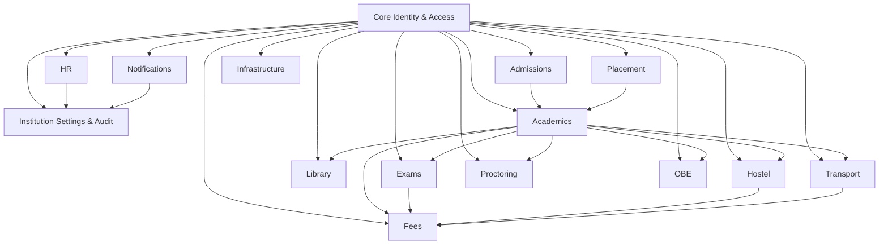

# ADR-001: Adopt Modular Monolith with RBAC Module Entitlements

## Status
Proposed

## Context
We are a 2–5 person team with moderate expertise and a product scale under 100k users. The current codebase is a tangled monolith. The product requires role-based login where modules are enabled per role, with a super_admin who can grant module access. We want changes in one module or feature to have minimal impact on others.

Current tech stack: React.js, Redux, Tailwind CSS, Node.js, Express, PostgreSQL, Redis.

## Decision
Adopt a modular monolith architecture with strict module boundaries and a role-based module entitlement system.

## Rationale
- Fits current scale and team size without microservices overhead.
- Enables clearer ownership and isolation per module, reducing change blast radius.
- Supports dynamic module access per role while keeping a single deployment unit.
- Keeps operational complexity low while improving maintainability and testability.

## Options Considered

| Option | Pros | Cons | Complexity | When Valid |
|---|---|---|---|---|
| Traditional monolith | Simple to run, fast to start | Coupling grows, changes ripple | Low | Very early MVP |
| Modular monolith | Clear boundaries, safer changes, easier extraction later | Requires discipline and enforcement | Medium | Small/medium teams, <=100k users |
| Microservices | Independent deploy/scale | High ops overhead, hard for small team | High | Team >10, independent scaling needs |

## Decision Details

### Module Boundaries
Define modules by business capability and enforce boundaries in code:
- Identity/Auth: login, sessions, password flows, MFA
- Access Control: roles, permissions, module entitlements, super_admin flows
- Module Catalog: list of available modules and metadata
- User Management: users, orgs/tenants if needed
- Feature Modules: each business module, starting with Academics (e.g., Academics, Admissions, Exams, Fees, Library, Hostel, Transport, Placement, HR/Payroll, Proctoring, Notifications, Infrastructure, Settings, OBE)
- Admin UI: super_admin management UX

### Boundary Rules
- Each module owns its database tables and write logic.
- Other modules interact only through the module’s public API (service interface).
- No cross-module direct DB writes.
- Shared utilities are minimal and isolated in a small shared kernel.
- CI or lint rules enforce dependency boundaries.

### RBAC and Module Entitlements
- Model `Module`, `Permission`, `Role`, `RoleModuleGrant`.
- `super_admin` has access to all modules and can grant modules to roles.
- Backend enforces permissions at route/handler level.
- Frontend navigation and module loading is driven by entitlements.

### Change Isolation Strategy
- Feature code stays inside its module.
- Modules expose a small, stable internal API.
- Contract tests verify module boundaries and API stability.
- Use internal events or message patterns for cross-module notifications.

## Trade-offs
- Single deployment unit means any change is deployed together.
- Requires discipline to keep module boundaries clean.
- Some duplication may be accepted to avoid tight coupling.

## Consequences
- Positive: Clear separation, safer refactors, faster development.
- Negative: Boundary enforcement overhead.
- Mitigation: Add lint rules, code ownership, and contract tests.

## Revisit Trigger
Reassess if:
- Team grows beyond 10 developers.
- Independent scaling needs become clear.
- Module boundaries are consistently violated or hard to maintain.

## Implementation Notes (Stack-Specific)
- Node/Express: create per-module routers and services; prohibit cross-module imports.
- PostgreSQL: per-module schema or table prefix naming to reflect ownership.
- Redis: use module-prefixed cache keys to avoid collisions.
- React/Tailwind: use a module registry to control navigation and conditional UI loading.

## Current Backend Module Map (Based on `backend/src`)
This is the proposed separation derived from existing models, controllers, and services.

1. Core Identity & Access
- Models: `User`, `Role`, `Permission`, `Session`
- Controllers: `authController.js`, `roleController.js`, `userController.js`
- Services: `authService.js`

1. Academics
- Models: `Department`, `Program`, `Course`, `CourseFaculty`, `Regulation`, `Timetable`, `TimetableSlot`, `SectionIncharge`, `SemesterResult`
- Controllers: `courseController.js`, `departmentController.js`, `programController.js`, `timetableController.js`, `sectionInchargeController.js`, `regulationController.js`, `grade-scale.controller.js`, `facultyAssignmentController.js`

1. Admissions
- Models: `AdmissionConfig`, `StudentApplication`, `StudentDocument`
- Controllers: `admissionController.js`, `admissionConfigController.js`, `admissionAnalyticsController.js`, `admissionIdController.js`
- Services: `admissionService.js`

1. Examinations
- Models: all in `models/exam/*`
- Controllers: `controllers/exam/*`, `exam-config.controller.js`
- Services: `eligibilityService.js`

1. Fees & Finance
- Models: `FeeCategory`, `FeeStructure`, `FeePayment`, `FeeWaiver`, `StudentFeeCharge`, `FeeSemesterConfig`, `AcademicFeePayment`, `StudentChargePayment`
- Controllers: `feeController.js`

1. Library
- Models: `Book`, `BookIssue`
- Controllers: `libraryController.js`

1. Hostel
- Models: all `Hostel*`
- Controllers: `hostelController.js`, `hostelFinesController.js`, `hostelGatePassController.js`, `hostelReportController.js`, `hostelRoomBillsController.js`

1. Transport
- Models: `Route`, `TransportStop`, `Vehicle`, `TransportDriver`, `VehicleRouteAssignment`, `StudentRouteAllocation`, `SpecialTrip`, `TripLog`
- Controllers: `transportController.js`

1. Placement & Careers
- Models: `Company`, `CompanyContact`, `JobPosting`, `PlacementDrive`, `DriveEligibility`, `DriveRound`, `StudentPlacementProfile`, `StudentApplication`, `RoundResult`, `Placement`, `PlacementPolicy`, `PlacementNotification`, `PlacementDocument`
- Controllers: `companyController.js`, `jobPostingController.js`, `placementDriveController.js`, `studentPlacementController.js`, `departmentPlacementController.js`
- Services: `placementPolicyService.js`

1. HR & Payroll
- Models: `StaffAttendance`, `LeaveBalance`, `LeaveRequest`, `SalaryStructure`, `SalaryGrade`, `Payslip`
- Controllers: `staffAttendanceController.js`, `payrollController.js`, `hrDashboardController.js`
- Services: `leaveService.js`

1. Proctoring
- Models: `ProctorAssignment`, `ProctorSession`, `ProctorFeedback`, `ProctorAlert`
- Controllers: `proctorController.js`

1. Notifications
- Models: `Notification`
- Controllers: `notificationController.js`

1. Infrastructure & Facilities
- Models: `Block`, `Room`
- Controllers: `infrastructureController.js`

1. Institution Settings & Audit
- Models: `InstitutionSetting`, `Holiday`, `AuditLog`
- Controllers: `settingController.js`, `holidayController.js`, `dashboardController.js`
- Services: `auditService.js`

1. Outcome-Based Education (OBE)
- Models: `ProgramOutcome`, `CourseOutcome`, `CoPoMap`
- Controllers: `programOutcomeController.js`, `courseOutcomeController.js`, `coPoMapController.js`

## Module Dependency Diagram
Dependencies point toward the provider module. Core Identity & Access is the shared kernel that other modules depend on.

## Controller/Service Refactor Targets
To align with modular monolith boundaries:

1. Move controllers into `backend/src/modules/<module>/controllers`.
1. Introduce module services in `backend/src/modules/<module>/services` and shift business logic there.
1. Restrict cross-module data access to module APIs (no direct model access across modules).
1. Move routes into `backend/src/modules/<module>/routes` and compose them in the app entrypoint.
